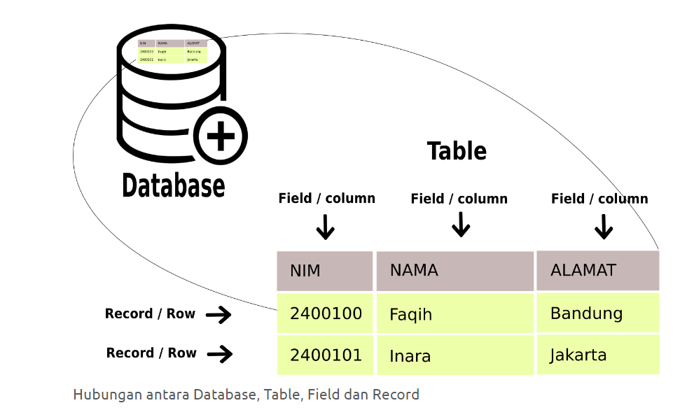

# BELAJAR DATABASE MYSQL


#### By: Gian Nurwana

-------------------------

## PENGANTAR MySQL

- Database (Basis Data) merupakan kumpulan data yang tersimpan dan terorganisir, sehingga mudah untuk diakses, dikelola, dan diperbarui
- DBMS (Database Management System) adalah perangkat lunak yang dirancang untuk mengelola, menyimpan, mengakses, dan memanipulasi data dalam database
- pada pembahasan kali ini kita akan menggunakan MySQL sebagai DBMS
- MySQL adalah salah satu sistem manajemen basis data relasional (RDBMS) yang paling populer. RDBMS adalah jenis database yang menggunakan tabel untuk menyimpan data dan mengorganisasikannya berdasarkan hubungan yang terbentuk antara tabel-tabel tersebut.
- MySQL pertama kali dibuat oleh Michael Widenius dan David Axmark pada tahun 1994, dan dirilis ke publik pada tahun 1995, dengan tujuan untuk membuat sebuah sistem manajemen basis data yang ringan, cepat, dan dapat diakses secara mudah.
- untuk menggunakan MySQL, kita menggunakan bahasa SQL (Structure Query Language)
- penulisan sintaks query di MySQL bersifat case insensitive (huruf besar dan kecil dianggap sama atau tidak dibedakan), dan diakhiri dengan titik koma
- di dalam MySQL terdapat table, field/column, row/baris
- di dalam satu table, harus ada kunci utama (Primary Key) dan bersifat unik (tidak boleh sama)
- berikut merupakan penjelasan dari table, record dan row pada database MySQL:
  


Secara garis besar, dalam database sql terdapat dua jenis perintah :  
1. DDL (Data Definition Language)  
   - perintah-perintah dalam bahasa basis data untuk membuat struktur bentuk dari basis data yang akan kita buat, 
   - Misalnya perintah untuk membuat, mengubah atau menghapus basis data (arsip), tempat menyimpan tabel (file)

2. DML (Data Manipulation Language)
   - DML merupakan perintah-perintah dalam bahasa basis data untuk memanipulasi data setelah kita buat struktur basis datanya menggunakan DDL  
   - Misalnya menambah, mengubah, menghapus, mencari data di tabel


### Tipe data dasar pada MySQL

INTEGER (INT):
  -  Menyimpan nilai bilangan bulat tanpa desimal.
  - Contoh: 10, -5, 1000.

FLOAT:
  - Menyimpan nilai bilangan pecahan dengan desimal.
  - Contoh: 3.14, -0.5, 1000.25.
  
DOUBLE:
- Menyimpan nilai bilangan pecahan dengan desimal, memiliki presisi dua kali lipat dari FLOAT.
Contoh: 3.14, -0.5, 1000.25.

DECIMAL:
- Menyimpan nilai pecahan dengan desimal, dengan presisi yang dapat ditentukan.
- Contoh: 3.14, -0.5, 1000.25.

CHAR:
- Menyimpan string dengan panjang tetap.
- Contoh: 'Hello', '123', 'MySQL'.

VARCHAR:
- Menyimpan string dengan panjang variabel.
- Contoh: 'Hello', '123', 'MySQL'.

TEXT:
- Menyimpan teks dengan panjang variabel, digunakan untuk teks yang lebih panjang.
- Contoh: 'Lorem ipsum dolor sit amet...'.

DATE:
- Menyimpan nilai tanggal.
- Contoh: '2024-02-23'.

TIME:
- Menyimpan nilai waktu.
- Contoh: '12:30:00'.

DATETIME:
- Menyimpan nilai tanggal dan waktu.
- Contoh: '2024-02-23 12:30:00'.

BOOLEAN (TINYINT(1))
- Menyimpan nilai boolean dengan 0 untuk false dan 1 untuk true.

---------------

### MENJALANKAN MYSQL


Pastikan mysql sudah dijalankan (start)

masuk ke database melalui command prompt, contoh path `E:\xampp\mysql\bin`

untuk masuk ke MySQL, ketikkan perintah

```bash
mysql -u root -p
```

jika meminta password tekan enter


Melihat database tersedia
```sql
SHOW DATABASES;
```

## DDL (DATA DEFINITION LANGUAGE)

Membuat database (membuat database toko)
```sql
CREATE DATABASE db_toko;
```

Menggunakan database db_toko
```sql
USE db_toko;
```

Melihat table yang ada di database db_toko
```sql
SHOW TABLES;
```

Misalnya kita mempunyai data produk seperti ini, tentukan spesifikasi table nya


### Membuat table produk
```sql
CREATE TABLE produk (
  id INT NOT NULL PRIMARY KEY AUTO_INCREMENT,
  nama VARCHAR(50) DEFAULT NULL,
  harga INT NULL DEFAULT 0,
  stok INT NULL DEFAULT 0
);
```

## DML (DATA MANIPULATION LANGUAGE)

### INSERT DATA ke table produk  

```sql
INSERT INTO produk(id, nama, harga, stok)
VALUES(1, "Indomie Bawang", 2500, 20);
```

### READ DATA (SELECT)

menampilkan semua data produk
```
SELECT * FROM produk
```

### INSERT DATA ke table produk  

```sql
INSERT INTO produk
VALUES(2, "Air Aqua botol", 2500, 20);
```

kita juga bisa mendefinisikan hanya kolom apa aja yang diisi

```sql
INSERT INTO produk(nama, harga, stok)
VALUES("Kecap Bango", 6000, 50);
```

kita juga bisa melakukan multiple insert data
```sql
INSERT INTO produk (nama, harga, stok) VALUES
('Indomie Soto', 2500, 50),
('Indomie Goreng', 3000, 50),
('Sabun Mandi', 15000, 50),
('Pasta Gigi', 10000, 30);
```

### Latihan Insert produk

| nama              |    harga | stok |
| ----------------- | -------: | ---: |
| Smart TV LG       |  8000000 |   15 |
| Laptop ASUS ROG   | 15000000 |   10 |
| Iphone 13 Pro MAx | 12000000 |   20 |
| Samsung S23 5G    | 10000000 |   12 |
| Macbook Pro M1    | 21000000 |   18 |

```sql
INSERT INTO produk (nama, harga, stok) VALUES
  ('Smart TV LG', 8000000, 15),
  ('Laptop ASUS ROG', 15000000, 10),
  ('Iphone 13 Pro Max', 12000000, 20),
  ('Samsung S23 5G', 10000000, 12),
  ('Macbook Pro M1', 21000000, 18);
```

### UPDATE DATA produk

update data produk ubah harga=3500  
kondisi: yang memiliki id 1,
```sql
UPDATE produk SET harga = 3500 WHERE id = 1;
```

update data produk ubah harga=4500 dan nama="Indomie Bawang Update" berdasarkan id 1
```sql
UPDATE produk SET harga = 4500, nama = "Indomie Bawang Update" WHERE id = 1;
```

### DELETE DATA produk
```sql
DELETE FROM produk WHERE id = 1;
```

### SELECT DATA (ADVANCE)

menampilkan hanya beberapa kolom tertentu
```sql
SELECT nama, stok from produk
```

menampilkan produk yang memiliki id 1
```sql
SELECT * FROM produk WHERE id = 1
```

menampilkan produk yang harganya kurang dari 10_000
```sql
SELECT * FROM produk where harga < 10_000
```

menampilkan produk yang stoknya lebih dari 10
```sql
SELECT * FROM produk where stok > 10
```

menampilkan produk yang harganya kurang dari 10_000 DAN stok lebih dari 10
```sql
SELECT * FROM produk where harga < 10_000 AND stok > 10
```

menampilkan produk yang harganya kurang dari 10_000 ATAU stok lebih dari 10
```sql
SELECT * FROM produk where harga < 10_000 OR stok > 10
```

menampilkan produk yang nama nya mengandung kata mie
```sql
SELECT * FROM produk WHERE nama LIKE "%mie%"
```

menampilkan produk, diurutkan berdasarkan nama (ASC/DESC)
```sql
SELECT * FROM produk ORDER BY nama ASC
```

menghitung total data di table produk
```sql
SELECT COUNT(*) FROM produk
```

menghitung total stok semua barang di table produk
```sql
SELECT SUM(*) FROM produk
```


